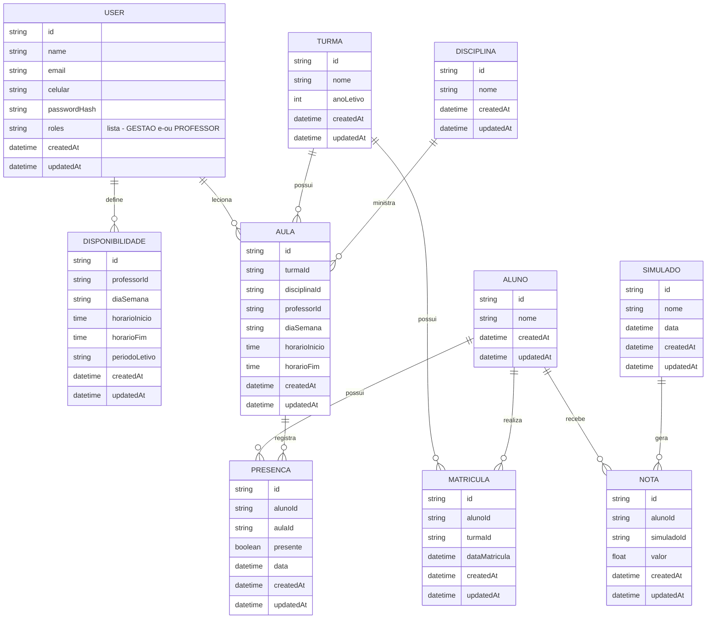

# Definicao do Banco de Dados

Este documento representa visualmente o modelo de dados do sistema, com base nas decisoes registradas em `tecnologias.md`, `arquitetura-inicial.md` e `requisitos-nao-funcionais-e-lgpd.md`. Escopo: P0/P1 do backlog (`docs/lista-features/user-stories.md`), incluindo `Simulado`/`Nota` (P2), cujo dado de aluno ja foi confirmado como parte do escopo mesmo sem login de aluno.

O `schema.prisma` do backend e a fonte de verdade executavel; este diagrama deve ser mantido em sincronia com ele. Este e um documento vivo e sera refinado ao longo do desenvolvimento.

## Diagrama

## Notas de Design

- `User` representa gestao e/ou professor, nunca aluno. Aluno e entidade propria e mais enxuta (`Aluno`), sem `email`/`passwordHash`, porque nao autentica.
- `roles` e uma lista (`Role[]`), nao um valor unico. Permite um `User` acumular gestao e professor ao mesmo tempo, sem precisar de um terceiro valor de enum combinando os dois.
- `Disponibilidade` e `Aula` referenciam `User` via `professorId`. A regra "so um `User` com papel `PROFESSOR` pode ser `professorId`" e validada na camada de `Service`, nao no schema do banco.
- Horario usa campos simples (`diaSemana` + `horarioInicio` + `horarioFim`) em vez de entidade propria.
- `Simulado` e `Nota` sao entidades separadas. `Simulado` e o evento; `Nota` e o resultado, ligando `Aluno` + `Simulado`.
- `Nota` nao se relaciona com `Disciplina`, porque o simulado tem uma nota unica por aluno, nao quebrada por materia.
- `createdAt`/`updatedAt` existem em todas as entidades para depuracao, rastreio temporal e apoio a politica de retencao da LGPD.
- Auditoria de quem alterou presenca/nota segue como pendencia funcional futura, porque `updatedAt` informa quando algo mudou, mas nao quem mudou.
