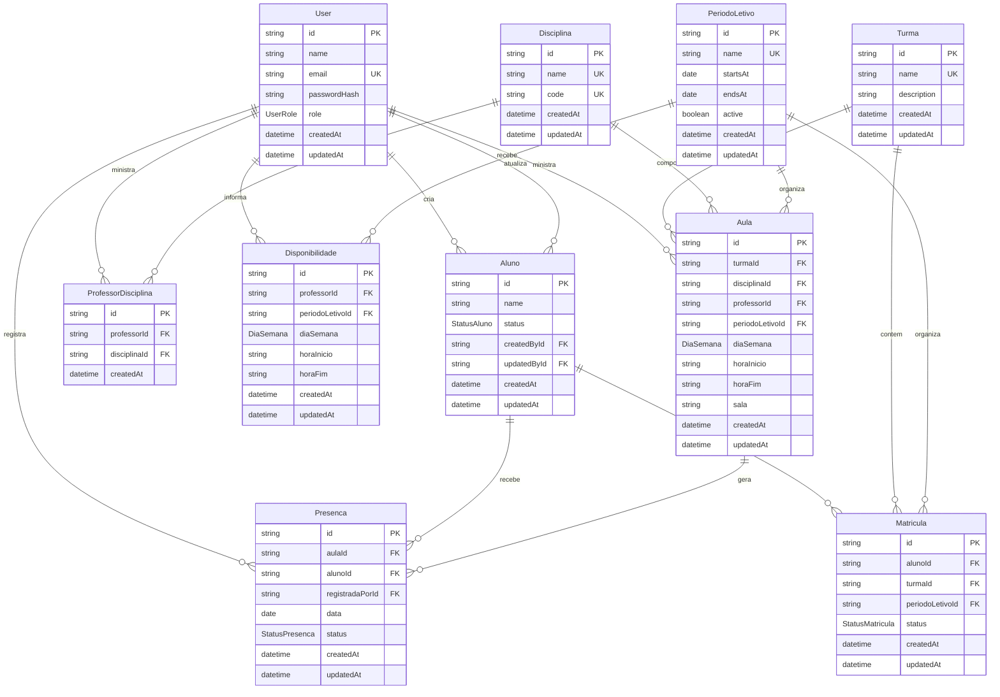

# Definicao do Banco de Dados

O banco de dados do MVP segue o recorte P0/P1 do backlog: autenticacao de gestao/professores, cadastro academico basico, disponibilidade docente, grade horaria e presenca.

## Decisoes de Modelagem

- `User` representa apenas usuarios autenticados: gestao e professor.
- `Aluno` e uma entidade separada, sem senha, pois o aluno e titular de dado e nao acessa o sistema no MVP.
- `PeriodoLetivo` organiza matriculas, disponibilidade e aulas por ciclo academico.
- `Aula` representa uma aula recorrente da grade horaria.
- `Presenca` registra a ocorrencia de uma aula em uma data especifica para um aluno.
- Campos de auditoria aparecem onde sao mais relevantes para LGPD: aluno e presenca.

## Entidades

## Regras Estruturais

- Um email de usuario deve ser unico.
- Uma matricula nao pode se repetir para o mesmo aluno, turma e periodo letivo.
- Um professor nao pode repetir a mesma disponibilidade no mesmo periodo, dia e horario.
- A mesma presenca nao pode ser registrada duas vezes para o mesmo aluno, aula e data.
- O mesmo professor nao deve ser associado duas vezes a mesma disciplina.
