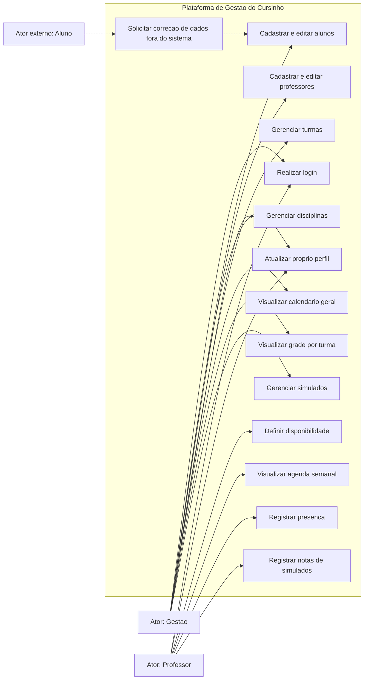

# Diagrama de Casos de Uso

Este diagrama deriva das user stories em `docs/lista-features/user-stories.md` e considera o recorte P0/P1 como o primeiro incremento implementavel do sistema.

## Atores

- **Gestao**: usuario autenticado responsavel por cadastro, planejamento academico e administracao.
- **Professor**: usuario autenticado responsavel por disponibilidade, agenda e registro de presenca.
- **Aluno**: titular dos dados academicos, mas nao usuario autenticado no MVP. Interage com a organizacao fora da plataforma; seus dados sao gerenciados por gestao e professores.

## Diagrama

## Observacoes

- O aluno aparece como ator externo para preservar a discussao de LGPD, mas nao possui login nem credenciais.
- Funcionalidades P2-P4, como dashboard, eventos sazonais, notas de simulados, relatorios e professores substitutos, devem ser adicionadas em iteracoes posteriores.
- O diagrama evita incluir geracao automatica de grade horaria neste primeiro recorte, porque isso pertence a P2 e aumentaria a complexidade inicial.
