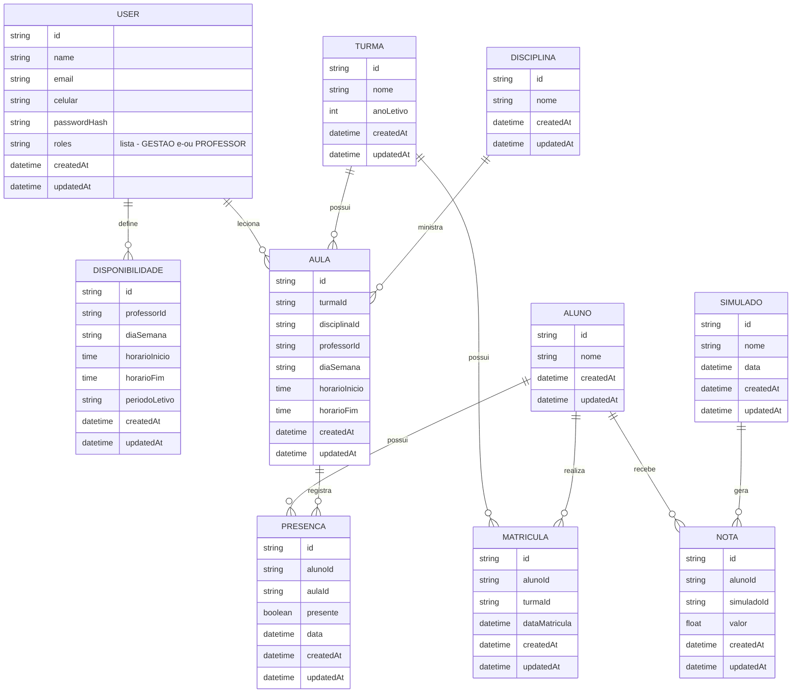

# Modelo de Domínio / Diagrama Entidade-Relacionamento (DER)

Este documento representa visualmente o modelo de dados do sistema, com base nas decisões registradas em `tecnologias.md`, `arquitetura-inicial.md` e `requisitos-nao-funcionais-e-lgpd.md`. Escopo: P0/P1 do backlog (`docs/lista-features/user-stories.md`), incluindo `Simulado`/`Nota` (P2), cujo dado de aluno já foi confirmado como parte do escopo mesmo sem login de aluno.

O `schema.prisma` do backend é a fonte de verdade executável; este diagrama deve ser mantido em sincronia com ele. Este é um documento vivo — será refinado ao longo do desenvolvimento.

## Diagrama

## Notas de design

- **`User` representa gestão e/ou professor, nunca aluno.** Aluno é entidade própria e mais enxuta (`Aluno`), sem `email`/`passwordHash`, porque não autentica (ver `requisitos-nao-funcionais-e-lgpd.md`).
- **`roles` é uma lista (`Role[]`), não um valor único.** Permite um `User` acumular gestão e professor ao mesmo tempo, sem precisar de um terceiro valor de enum combinando os dois. Toda checagem de permissão usa `roles.includes(...)`.
- **`Disponibilidade` e `Aula` referenciam `User` via `professorId`** — mesma tabela de gestão, diferenciada por `roles`. A regra "só um `User` com papel `PROFESSOR` pode ser `professorId`" é validada na camada de `Service`, não no schema do banco.
- **Horário como campos simples** (`diaSemana` + `horarioInicio` + `horarioFim`) em vez de entidade própria — não há hoje necessidade de reutilizar/referenciar um horário fora do contexto da `Aula`/`Disponibilidade` a que pertence. Pode ser revisto se a geração automática de grade horária (P2) exigir um catálogo fixo de slots.
- **`Simulado` e `Nota` são entidades separadas**, não uma única `NotaSimulado`: `Simulado` é o evento (pode ter várias notas associadas, uma por aluno); `Nota` é o resultado, ligando `Aluno` + `Simulado`. `Nota` **não** se relaciona com `Disciplina` — o simulado tem uma nota única por aluno, não quebrada por matéria.
- **`createdAt`/`updatedAt` em todas as entidades**: custo desprezível no Prisma (`@default(now())` / `@updatedAt`, sem lógica extra), útil para depuração e como referência para a política de retenção da LGPD. **Importante:** isso não resolve sozinho o requisito de "auditoria de quem alterou presença/nota" já registrado em `requisitos-nao-funcionais-e-lgpd.md` — `updatedAt` só diz *quando* algo mudou, não *quem* mudou. Auditoria de fato (rastrear o responsável pela alteração) segue como pendência em aberto, a desenhar quando `Presenca`/`Nota` forem implementadas (provável solução: campo `registradoPorId` referenciando `User`).
- **Pendência conhecida:** o `schema.prisma` atual ainda não reflete este modelo — tem apenas um `User` mínimo (com um bug de campo `updatedAt` duplicado) e nenhuma das demais entidades. Este diagrama descreve o modelo-alvo, a ser implementado incrementalmente por prioridade de backlog.
